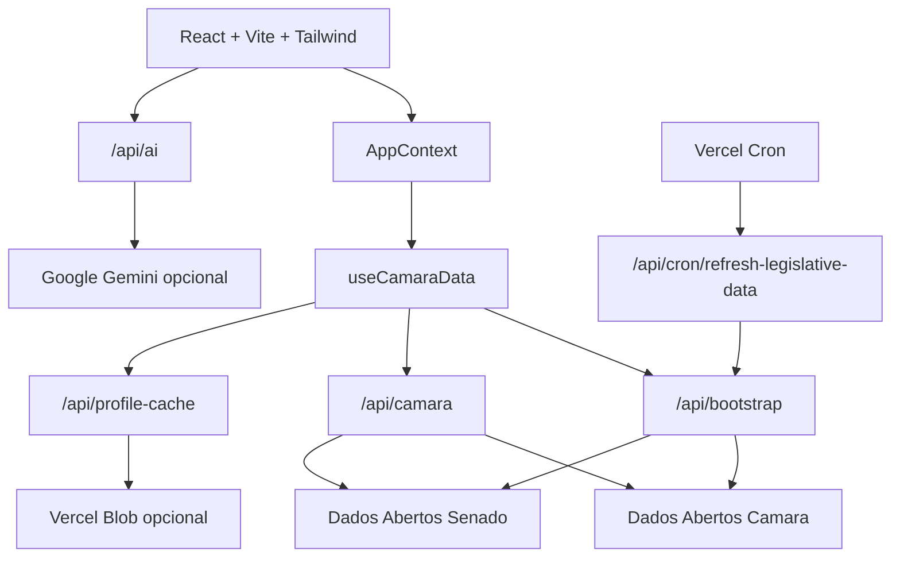

# PapoReto

Transparencia politica brasileira em linguagem direta.

[](https://papo-reto-beige.vercel.app/)
[](https://react.dev/)
[](https://www.typescriptlang.org/)
[](https://vite.dev/)
[](https://vercel.com/)

## Acesso Rapido

| Ambiente | Link |
| --- | --- |
| Aplicacao publicada | [papo-reto-beige.vercel.app](https://papo-reto-beige.vercel.app/) |
| Healthcheck | [`/api/health`](https://papo-reto-beige.vercel.app/api/health) |
| Bootstrap legislativo | [`/api/bootstrap`](https://papo-reto-beige.vercel.app/api/bootstrap) |

## O Que E

O PapoReto e uma aplicacao web para acompanhar politica brasileira com menos juridiques tecnico e mais contexto. Ela combina dados oficiais da Camara dos Deputados e do Senado Federal com uma camada de traducao visual, filtros por tema, perfis parlamentares, feed legislativo, guia cidadao e recursos opcionais de IA.

O objetivo e responder perguntas simples:

- Quem sao os parlamentares?
- O que esta acontecendo no Congresso?
- Quais temas estao em destaque?
- Quanto custa um mandato?
- Como transformar dados oficiais em algo que qualquer pessoa entende?

## Principais Recursos

| Area | O que entrega |
| --- | --- |
| Mural legislativo | Feed com atividades recentes, filtros por tema, fonte oficial e resumo didatico. |
| Perfis politicos | Dados de mandato, presenca, custos, frentes parlamentares, votacoes e historico. |
| Partidos | Visao de composicao partidaria e ideologia estimada por metadados internos. |
| Guia cidadao | Conteudo educativo sobre regras, termos e instituicoes politicas. |
| Chat e IA | Chat, imagens, voz, transcricao e conteudo educativo quando a chave de IA esta configurada. |
| Acessibilidade | Tema escuro, alto contraste, controle de fonte, navegacao mobile e onboarding. |
| Serverless BFF | Proxy seguro, bootstrap cacheado, healthcheck e cron de aquecimento. |

## Experiencia Do Produto


## Arquitetura



## Stack

| Camada | Tecnologia |
| --- | --- |
| Frontend | React 18, TypeScript, Vite |
| Estilo | Tailwind CSS via PostCSS |
| Icones | Lucide React |
| API/BFF | Vercel Serverless Functions |
| Cache persistente opcional | Vercel Blob |
| IA opcional | `@google/genai` |
| Qualidade | Vitest, Testing Library, ESLint, TypeScript |

## Estrutura Do Projeto

```text
.
|-- api/                         # Serverless functions no Vercel
|   |-- ai.ts                    # Acoes de IA com fallback sem chave
|   |-- bootstrap.ts             # Bootstrap/cache inicial
|   |-- camara.ts                # Proxy restrito para fontes oficiais
|   |-- health.ts                # Diagnostico de integracoes
|   |-- profile-cache.ts         # Cache de perfis
|   `-- cron/
|       `-- refresh-legislative-data.ts
|-- components/                  # UI reutilizavel
|-- contexts/                    # Estado global e navegacao
|-- domain/legislative/          # Regras puras de classificacao
|-- hooks/                       # Carregamento e enriquecimento de dados
|-- services/                    # Integracoes de Camara, cache e IA
|-- tests/                       # Testes unitarios e handlers
|-- utils/                       # Traducao legislativa e proxy client-side
`-- views/                       # Telas principais
```

## Como Rodar Localmente

Requisitos:

- Node.js 18+
- npm

```bash
npm install
npm run dev
```

Depois acesse:

```text
http://localhost:5173
```

### QA Local Com Dados De Producao

O Vite local nao executa as functions de `/api`. Para testar o frontend local usando dados reais de producao:

```bash
VITE_BOOTSTRAP_ENDPOINT=https://papo-reto-beige.vercel.app/api/bootstrap npm run dev
```

Quando `VITE_BOOTSTRAP_ENDPOINT` aponta para producao, o frontend tambem usa a origem publica para proxy legislativo, cache de perfil e IA.

## Scripts

| Comando | Uso |
| --- | --- |
| `npm run dev` | Inicia o Vite em modo desenvolvimento. |
| `npm run build` | Roda TypeScript e build de producao. |
| `npm run lint` | Executa ESLint. |
| `npm test` | Executa Vitest. |
| `npm audit --omit=dev` | Audita dependencias de producao. |

<details>
<summary><strong>Checklist rapido para novos contribuidores</strong></summary>

1. Rode `npm install`.
2. Rode `npm test` para validar a suite.
3. Rode `npm run lint -- --quiet`.
4. Rode `npm run build`.
5. Para testar com dados reais, use `VITE_BOOTSTRAP_ENDPOINT=https://papo-reto-beige.vercel.app/api/bootstrap npm run dev`.
6. Antes de publicar, confirme `git diff --check`.

</details>

## Variaveis De Ambiente

Crie `.env.local` quando precisar ativar IA, cache persistente ou endpoints especificos.

```bash
# IA opcional
API_KEY=...
# ou
GOOGLE_API_KEY=...

# Cache persistente opcional no Vercel Blob
BLOB_READ_WRITE_TOKEN=...

# Protecao opcional para chamadas manuais do cron
CRON_SECRET=...

# Origem publica para APIs quando o frontend roda fora do Vercel
VITE_PUBLIC_API_ORIGIN=https://papo-reto-beige.vercel.app

# Bootstrap inicial
VITE_BOOTSTRAP_ENDPOINT=/api/bootstrap

# Proxy legislativo
VITE_LEGISLATIVE_API_PROXY=/api/camara

# Cache de perfil
VITE_PROFILE_CACHE_ENDPOINT=/api/profile-cache
```

### Degradacao Segura

O app continua funcionando sem `API_KEY` e sem `BLOB_READ_WRITE_TOKEN`.

- Sem chave de IA: chat, audio, imagem e transcricao retornam fallback controlado.
- Sem Blob: caches funcionam em memoria por instancia serverless.

## Endpoints

| Metodo | Endpoint | Descricao |
| --- | --- | --- |
| `GET` | `/api/health` | Status da aplicacao e integracoes configuradas. |
| `GET` | `/api/bootstrap` | Dados iniciais: parlamentares, feed, partidos e artigos. |
| `GET` | `/api/camara?url=...` | Proxy restrito para Camara e Senado. |
| `GET` | `/api/cron/refresh-legislative-data` | Aquece o cache legislativo. |
| `POST` | `/api/ai` | Acoes de IA usadas pelo app. |
| `GET`/`PUT` | `/api/profile-cache?type=politician&id=...` | Cache de perfis parlamentares. |

## Cron Jobs

O `vercel.json` agenda o refresh legislativo diario:

```text
0 11 * * *
```

No plano Hobby da Vercel, crons diarios sao o limite seguro. Para refresh mais frequente, usar Vercel Pro e ajustar a expressao no `vercel.json`.

## Qualidade

Baseline atual:

- Build TypeScript + Vite
- ESLint
- Vitest
- Auditoria de dependencias de producao
- Handlers serverless testados
- Fallbacks para IA e cache
- Validacao de proxy legislativo

```bash
npm test
npm run lint -- --quiet
npm run build
npm audit --omit=dev
```

## Roadmap Sugerido

- Adicionar screenshots reais do produto no README.
- Criar testes E2E com Playwright no CI.
- Adicionar monitoramento com Sentry ou ferramenta equivalente.
- Persistir dados importantes em banco gerenciado se o volume crescer.
- Evoluir crons por dominio: feed, perfis populares, partidos e artigos.
- Melhorar comparativos: parlamentar vs partido, estado e media da Casa.

## Deploy

O deploy principal roda na Vercel:

[https://papo-reto-beige.vercel.app/](https://papo-reto-beige.vercel.app/)

Pushes para `main` disparam novo deploy quando o projeto esta conectado ao repositorio.

## Licenca

Este repositorio ainda nao declara uma licenca. Defina uma antes de liberar uso, copia ou distribuicao publica do codigo.
