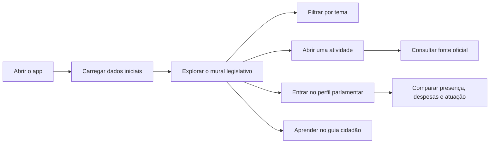
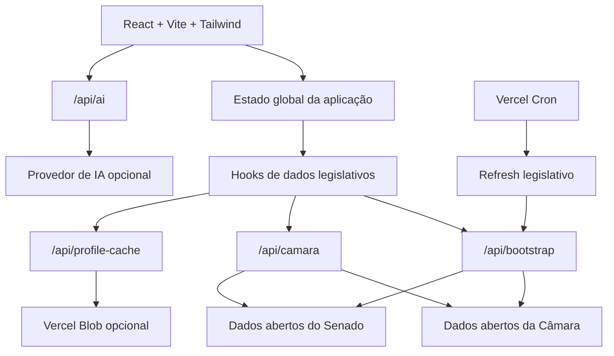

# Papo Reto

Transparência política brasileira em linguagem direta.

[](https://papo-reto-beige.vercel.app/)
[](https://react.dev/)
[](https://www.typescriptlang.org/)
[](https://vite.dev/)
[](https://vercel.com/)

<p align="center">
  
  
  
</p>

## Visão geral

O Papo Reto é uma aplicação web criada para aproximar dados legislativos brasileiros de uma experiência clara, navegável e útil para qualquer cidadão. O produto organiza informações públicas da Câmara dos Deputados e do Senado Federal em uma interface com linguagem simples, filtros práticos, perfis parlamentares, feed legislativo e recursos educativos.

A proposta não é substituir as fontes oficiais. A proposta é tornar a primeira leitura mais acessível: menos siglas soltas, menos telas difíceis de interpretar e mais contexto para entender o que está acontecendo no Congresso.

## Produto

| Área | Experiência entregue |
| --- | --- |
| Mural legislativo | Uma visão de atividades públicas recentes, com resumo direto, filtros por tema e acesso à fonte oficial. |
| Perfis parlamentares | Página de consulta com mandato, partido, estado, presença, despesas, votações e atuação política. |
| Partidos | Leitura organizada da composição partidária e de metadados úteis para comparação. |
| Guia cidadão | Conteúdo educativo para explicar termos, ritos e instituições sem linguagem excessivamente técnica. |
| IA opcional | Chat e geração de conteúdo educativo quando a integração estiver configurada. |
| Acessibilidade | Tema escuro, alto contraste, controle de fonte, navegação mobile e onboarding. |

## Por que este projeto existe

Dados públicos existem, mas nem sempre são fáceis de consumir. O Papo Reto trabalha a camada que normalmente falta entre a API oficial e o usuário final: contexto, hierarquia visual, tradução de termos e uma jornada pensada para investigação rápida.

Este repositório também funciona como peça de portfólio técnico. Ele mostra como um produto público pode ser estruturado com frontend moderno, BFF serverless, cache progressivo, fallback seguro e automações de qualidade sem depender de um backend monolítico.

## Jornada principal



## Arquitetura



## Decisões técnicas

| Decisão | Motivo |
| --- | --- |
| BFF serverless | Centraliza chamadas a fontes oficiais, reduz exposição do frontend e permite cache controlado. |
| Fallback para integrações opcionais | O app continua utilizável mesmo sem IA ou cache persistente configurados. |
| Proxy com host restrito | Evita transformar a API em proxy aberto para qualquer destino externo. |
| Bootstrap inicial | Reduz o custo de múltiplas chamadas no primeiro carregamento e melhora a percepção de velocidade. |
| Domínio legislativo separado | Mantém regras de classificação e tradução fora dos componentes visuais. |
| README dinâmico | Mantém sinais operacionais atualizados sem congelar dados voláteis no texto principal. |

## Stack

| Camada | Tecnologia |
| --- | --- |
| Frontend | React, TypeScript e Vite |
| Estilo | Tailwind CSS via PostCSS |
| Ícones | Lucide React |
| API/BFF | Vercel Serverless Functions |
| Cache persistente opcional | Vercel Blob |
| IA opcional | Integração generativa configurável |
| Qualidade | Vitest, Testing Library, ESLint e TypeScript |

## Estrutura do projeto

```text
.
|-- api/                         # Serverless functions no Vercel
|   |-- ai.ts                    # Ações de IA com fallback sem chave
|   |-- bootstrap.ts             # Bootstrap e cache inicial
|   |-- camara.ts                # Proxy restrito para fontes oficiais
|   |-- health.ts                # Diagnóstico de integrações
|   |-- profile-cache.ts         # Cache de perfis
|   `-- cron/
|       `-- refresh-legislative-data.ts
|-- components/                  # UI reutilizável
|-- contexts/                    # Estado global e navegação
|-- domain/legislative/          # Regras puras de classificação
|-- hooks/                       # Carregamento e enriquecimento de dados
|-- services/                    # Integrações de Câmara, cache e IA
|-- tests/                       # Testes unitários e handlers
|-- utils/                       # Tradução legislativa e proxy client-side
`-- views/                       # Telas principais
```

## Qualidade e operação

O projeto foi pensado para falhar de forma controlada. Quando uma integração opcional não está disponível, a aplicação preserva a experiência principal e informa estados de fallback em vez de quebrar a navegação.

| Pilar | Como aparece no projeto |
| --- | --- |
| Confiabilidade | Verificação de saúde, fallback de IA, cache em memória e refresh automatizado. |
| Segurança | Proxy restrito por host, validação de entrada e segredos via variáveis de ambiente. |
| Manutenibilidade | Separação entre domínio, serviços, hooks e visualizações. |
| Qualidade | Testes automatizados, lint, build TypeScript e auditoria de dependências. |
| Observabilidade | Endpoint de saúde e cartões dinâmicos no README para leitura rápida do estado público. |

## README dinâmico

Os cartões no topo do README são gerados automaticamente pelo próprio repositório. Eles servem como sinais vivos do projeto: status público, leitura dos dados legislativos e base técnica.

O texto principal evita números que mudam com o tempo. Métricas operacionais ficam nos arquivos gerados em `docs/readme`, que são atualizados pelo workflow [`README widgets`](.github/workflows/readme-widgets.yml).

Arquivos gerados:

- [`docs/readme/status.svg`](docs/readme/status.svg)
- [`docs/readme/data.svg`](docs/readme/data.svg)
- [`docs/readme/quality.svg`](docs/readme/quality.svg)
- [`docs/readme/metrics.json`](docs/readme/metrics.json)

Para atualizar localmente:

```bash
npm run readme:widgets
```

## Como rodar localmente

Requisitos:

- Node.js 18+
- npm

```bash
npm install
npm run dev
```

Depois acesse:

```text
http://localhost:5173
```

### QA local com dados de produção

O Vite local não executa as functions de `/api`. Para testar o frontend local usando dados reais de produção:

```bash
VITE_BOOTSTRAP_ENDPOINT=https://papo-reto-beige.vercel.app/api/bootstrap npm run dev
```

Quando `VITE_BOOTSTRAP_ENDPOINT` aponta para produção, o frontend também usa a origem pública para proxy legislativo, cache de perfil e IA.

## Scripts úteis

| Comando | Uso |
| --- | --- |
| `npm run dev` | Inicia o Vite em modo desenvolvimento. |
| `npm run build` | Roda TypeScript e build de produção. |
| `npm run lint` | Executa ESLint. |
| `npm test` | Executa Vitest. |
| `npm audit --omit=dev` | Audita dependências de produção. |
| `npm run readme:widgets` | Atualiza os cartões dinâmicos do README. |

## Variáveis de ambiente

Crie `.env.local` quando precisar ativar IA, cache persistente ou endpoints específicos.

```bash
# IA opcional
API_KEY=...

# Cache persistente opcional no Vercel Blob
BLOB_READ_WRITE_TOKEN=...

# Escrita server-side no cache de perfis
PROFILE_CACHE_WRITE_SECRET=...

# Proteção do cron em produção
CRON_SECRET=...

# Origem pública para APIs quando o frontend roda fora do Vercel
VITE_PUBLIC_API_ORIGIN=https://papo-reto-beige.vercel.app

# Bootstrap inicial
VITE_BOOTSTRAP_ENDPOINT=/api/bootstrap

# Proxy legislativo
VITE_LEGISLATIVE_API_PROXY=/api/camara

# Cache de perfil
VITE_PROFILE_CACHE_ENDPOINT=/api/profile-cache
```

## Endpoints

| Método | Endpoint | Papel no produto |
| --- | --- | --- |
| `GET` | `/api/health` | Expõe o estado da aplicação e das integrações configuradas. |
| `GET` | `/api/bootstrap` | Entrega o pacote inicial de dados para a experiência principal. |
| `GET` | `/api/camara?url=...` | Faz proxy controlado para fontes legislativas oficiais. |
| `GET` | `/api/cron/refresh-legislative-data` | Aquece o cache legislativo de forma automatizada. |
| `POST` | `/api/ai` | Executa ações de IA usadas pelo app quando a chave está configurada. |
| `GET`/`PUT` | `/api/profile-cache?type=politician&id=...` | Consulta cache de perfis; escrita exige segredo server-side. |

## Evolução planejada

- Adicionar screenshots reais do produto no README.
- Criar testes E2E com Playwright no CI.
- Adicionar monitoramento com Sentry ou ferramenta equivalente.
- Evoluir comparativos entre parlamentar, partido, estado e média da Casa.

## Deploy

O deploy principal roda na Vercel:

[https://papo-reto-beige.vercel.app/](https://papo-reto-beige.vercel.app/)

Pushes para `main` disparam novo deploy quando o projeto está conectado ao repositório.

## Licença

Este repositório ainda não declara uma licença. Defina uma antes de liberar uso, cópia ou distribuição pública do código.
