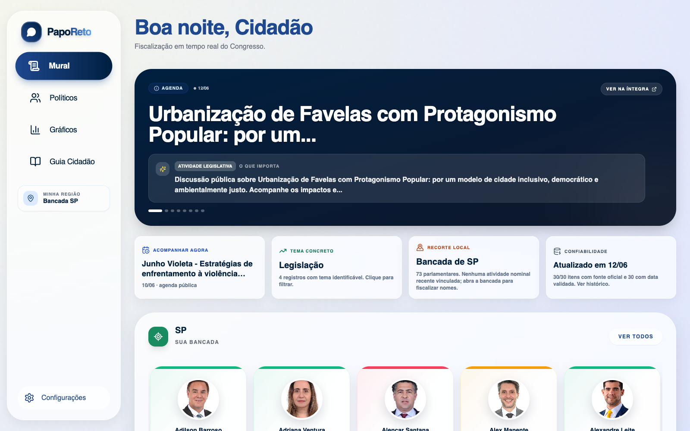
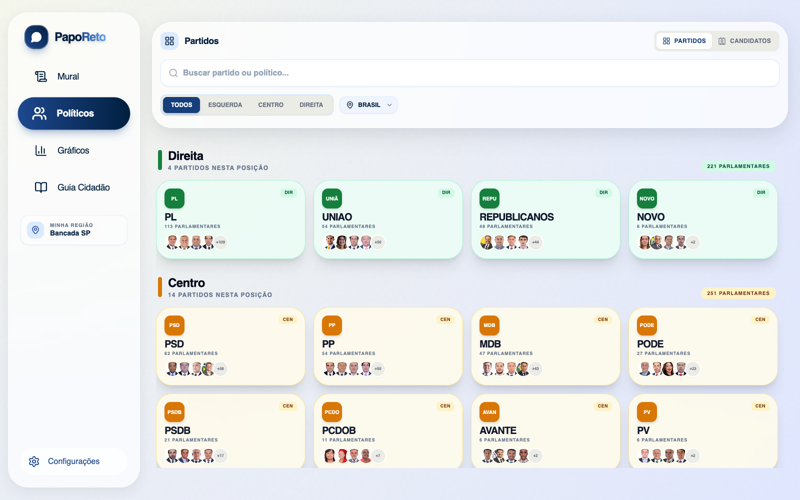
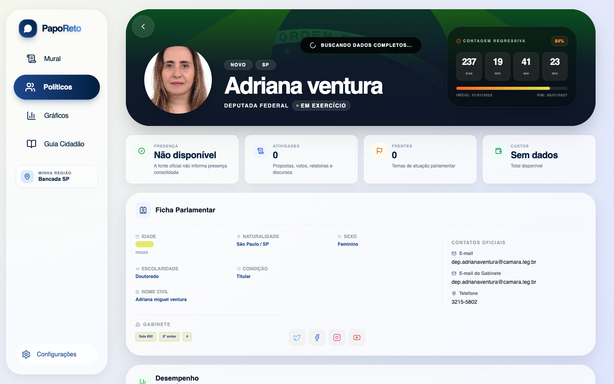
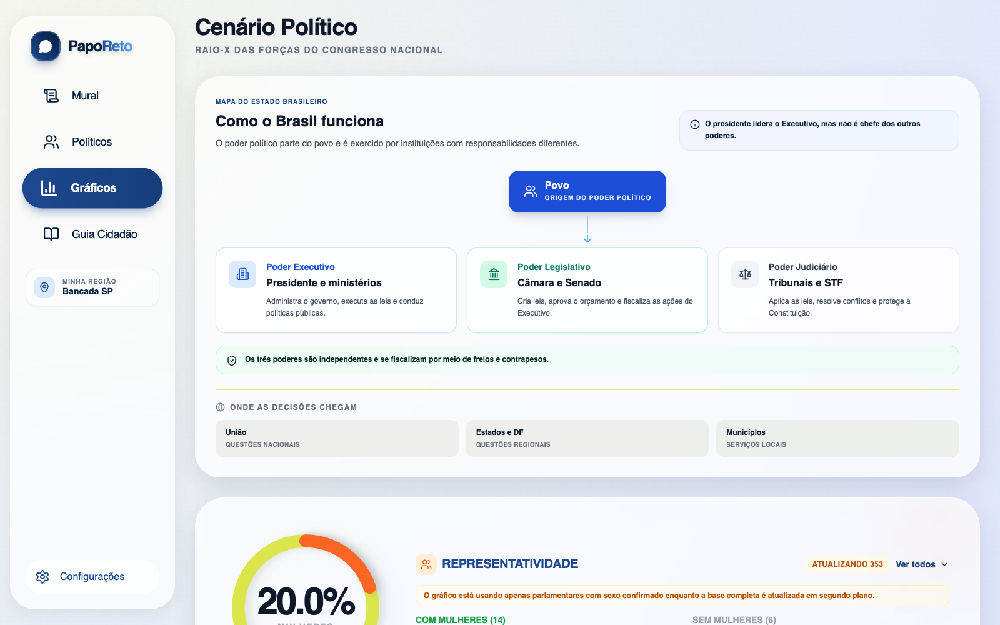
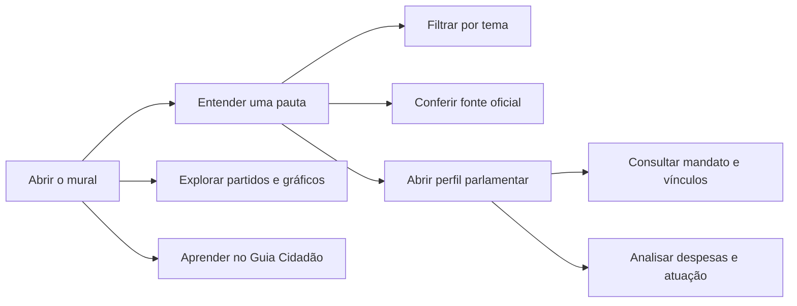
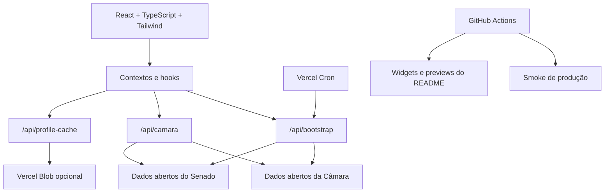

<p align="center">
  
</p>

<h1 align="center">Papo Reto</h1>

<p align="center"><strong>Transparência política brasileira em linguagem direta, visual e verificável.</strong></p>

<p align="center">
  <a href="https://papo-reto-beige.vercel.app/">Experimentar o app</a> ·
  <a href="https://papo-reto-beige.vercel.app/">Explorar o mural</a> ·
  <a href="#dados-e-confiabilidade">Ver dados oficiais</a> ·
  <a href="#arquitetura">Entender a arquitetura</a>
</p>

<p align="center">
  <a href="https://papo-reto-beige.vercel.app/"></a>
  <a href="https://github.com/Chrisllan02/Papo-Reto/actions/workflows/ci.yml"></a>
  <a href="https://github.com/Chrisllan02/Papo-Reto/actions/workflows/production-smoke.yml"></a>
</p>

<a href="https://papo-reto-beige.vercel.app/">
  
</a>

> A prévia acima é capturada automaticamente da aplicação publicada. Clique na imagem para abrir o produto.

## O produto

O Papo Reto transforma dados legislativos públicos da Câmara dos Deputados e do Senado Federal em uma experiência que ajuda o cidadão a responder perguntas concretas:

- **O que está acontecendo agora no Congresso?**
- **Por que uma pauta importa e qual é o próximo passo?**
- **Quem representa meu estado e como atua?**
- **Como partidos e poderes se organizam?**
- **Onde posso conferir a informação original?**

Cada leitura relevante mantém acesso à fonte oficial. O objetivo não é substituir os portais públicos, mas reduzir a distância entre o dado bruto e a compreensão.

<p align="center">
  <a href="https://papo-reto-beige.vercel.app/">
    
  </a>
  <a href="https://papo-reto-beige.vercel.app/">
    
  </a>
  <a href="https://github.com/Chrisllan02/Papo-Reto/actions">
    
  </a>
</p>

## Explore a experiência

| Partidos e parlamentares | Perfil parlamentar |
| --- | --- |
| [](https://papo-reto-beige.vercel.app/) | [](https://papo-reto-beige.vercel.app/) |
| Compare a composição política e navegue entre partidos e representantes. | Consulte mandato, vínculos oficiais, agenda, despesas e atuação sem dados simulados. |

<a href="https://papo-reto-beige.vercel.app/">
  
</a>

<details>
<summary><strong>O que existe hoje na plataforma</strong></summary>

| Área | O que o usuário encontra |
| --- | --- |
| Mural legislativo | Atividades recentes, filtros temáticos, contexto cidadão, recorte local e links oficiais. |
| Políticos e partidos | Busca, filtros, composição partidária e navegação por representantes. |
| Perfil parlamentar | Dados biográficos oficiais, mandato, vínculos, agenda, frentes, trajetória e despesas. |
| Gráficos | Cenário partidário, força regional, representatividade e estrutura didática dos poderes. |
| Guia cidadão | Conteúdo educativo gerado a partir de pautas reais e acervo histórico. |
| Acessibilidade | Modo escuro, alto contraste, ajuste de fonte e navegação responsiva. |

</details>

## Fluxo principal



## Dados e confiabilidade

O produto diferencia claramente **dado oficial disponível**, **informação ausente** e **integração opcional**. Métricas não fornecidas pelas fontes consultadas não são inventadas nem apresentadas como zero.

| Princípio | Aplicação prática |
| --- | --- |
| Rastreabilidade | Atividades, pautas, perfis e documentos apontam para fontes oficiais. |
| Dados persistentes | Cache progressivo mantém o último dado confiável quando APIs públicas oscilam. |
| Privacidade | Identificadores pessoais sensíveis não são exibidos. |
| Falha controlada | IA e cache persistente são opcionais; o núcleo do app continua funcional sem eles. |
| Atualização automática | Cron, smoke tests e widgets verificam produção e renovam sinais públicos. |

## Arquitetura



<details>
<summary><strong>Decisões técnicas</strong></summary>

| Decisão | Motivo |
| --- | --- |
| BFF serverless | Centraliza integrações oficiais, permite cache e evita chamadas frágeis diretamente do navegador. |
| Bootstrap inicial | Entrega um pacote consistente para o primeiro carregamento. |
| Cache progressivo | Evita que oscilações das APIs públicas apaguem dados já carregados. |
| Domínio legislativo separado | Mantém classificação e tradução fora dos componentes visuais. |
| Fallback explícito | Recursos opcionais falham sem derrubar a experiência principal. |
| README automatizado | A documentação mostra o estado e a aparência reais do produto. |

</details>

## Stack

`React` · `TypeScript` · `Vite` · `Tailwind CSS` · `Lucide React` · `Vercel Functions` · `Vercel Blob` · `Vitest` · `Testing Library` · `Playwright` · `GitHub Actions`

## Executar localmente

```bash
npm install
npm run dev
```

O Vite local não executa as funções serverless. Para usar os dados da produção durante o desenvolvimento:

```bash
VITE_BOOTSTRAP_ENDPOINT=https://papo-reto-beige.vercel.app/api/bootstrap npm run dev
```

<details>
<summary><strong>Scripts disponíveis</strong></summary>

| Comando | Finalidade |
| --- | --- |
| `npm run dev` | Inicia o frontend local. |
| `npm run build` | Valida TypeScript e gera o build. |
| `npm test` | Executa os testes automatizados. |
| `npm run lint` | Analisa o código com ESLint. |
| `npm run smoke:prod` | Valida aplicação e APIs publicadas. |
| `npm run readme:widgets` | Atualiza cartões dinâmicos do README. |
| `npm run readme:preview` | Captura telas reais da produção para o README. |

</details>

<details>
<summary><strong>Estrutura do repositório</strong></summary>

```text
.
|-- api/                         # Funções serverless, cron e cache
|-- components/                  # Componentes reutilizáveis
|-- contexts/                    # Estado global e navegação
|-- domain/legislative/          # Regras do domínio legislativo
|-- hooks/                       # Carregamento e enriquecimento
|-- services/                    # Integrações oficiais e IA opcional
|-- tests/                       # Testes de componentes e handlers
|-- utils/                       # Tradução e utilitários
|-- views/                       # Telas do produto
|-- scripts/                     # Smoke, widgets e captura de previews
`-- docs/readme/                 # Assets dinâmicos desta página
```

</details>

## Automação do README

O workflow [`README widgets`](.github/workflows/readme-widgets.yml) executa diariamente e também pode ser disparado manualmente. Ele:

1. consulta a aplicação publicada e as APIs públicas;
2. atualiza os cartões SVG de status, dados e qualidade;
3. abre a produção com Playwright;
4. captura as telas reais do produto;
5. publica os assets atualizados no próprio repositório.

Assim, este README funciona como uma demonstração viva do projeto, sem congelar números ou imagens que mudam com o tempo.

## Qualidade e operação

[](https://github.com/Chrisllan02/Papo-Reto/actions/workflows/ci.yml)
[](https://github.com/Chrisllan02/Papo-Reto/actions/workflows/production-smoke.yml)
[](https://github.com/Chrisllan02/Papo-Reto/actions/workflows/readme-widgets.yml)

## Produção

**[Abrir o Papo Reto](https://papo-reto-beige.vercel.app/)**

O deploy principal roda na Vercel. Pushes em `main` são publicados automaticamente.

## Licença

Este repositório ainda não declara uma licença. Defina uma antes de liberar uso, cópia ou distribuição pública do código.
